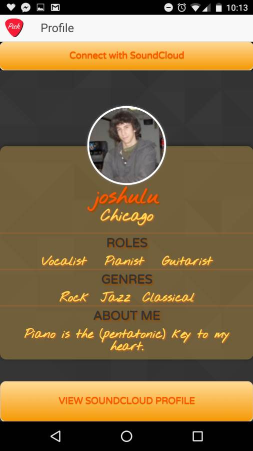
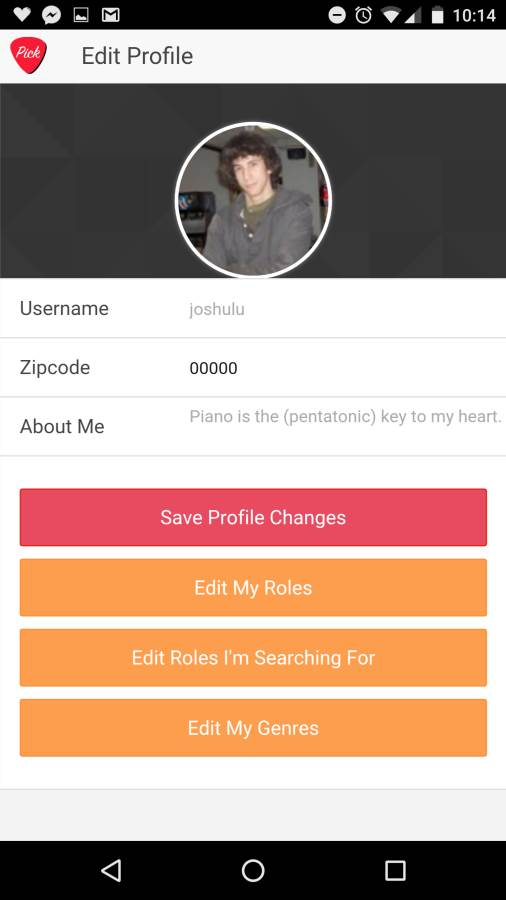
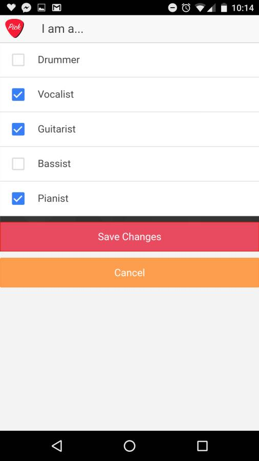
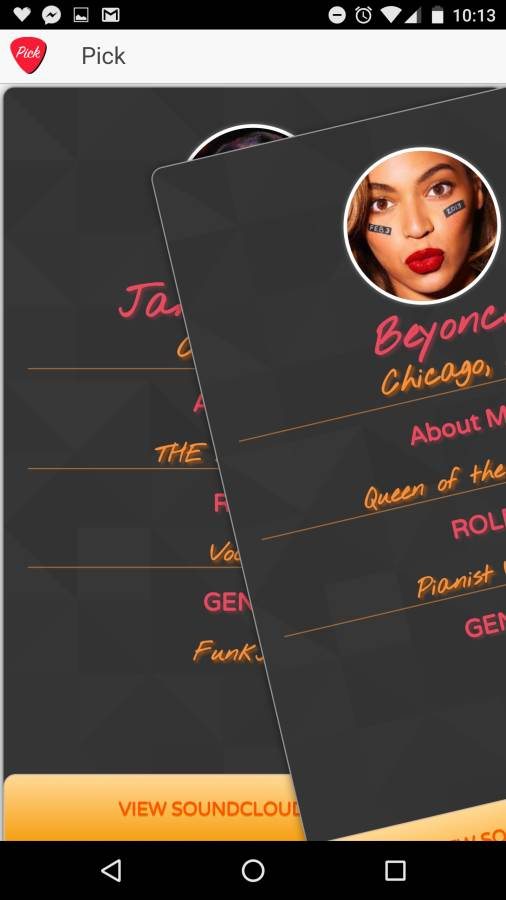
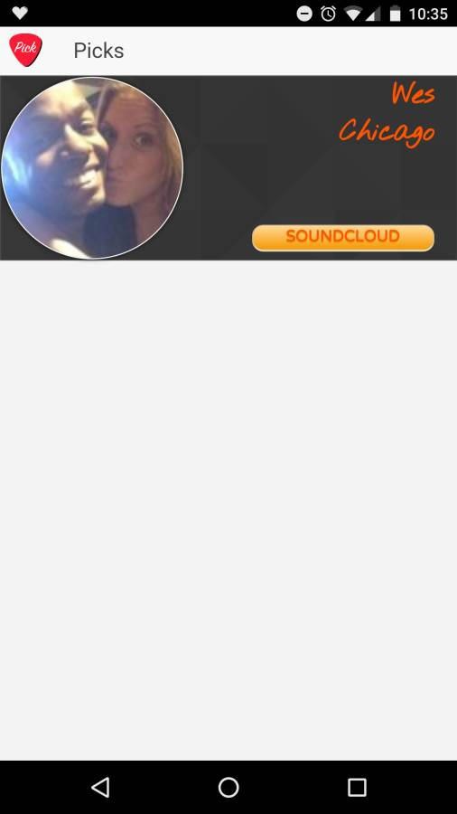

# pick-mobile

The  app allows local musicians to connect with one another.

This is the front-end of our mobile app, Pick. It was build in AngularJS and Ionic, and it provides an Android and iOS compatible user interface.

The app is not currently deployed to the Google Play Store or IOS App Store.

> The launch page upon opening the app

> User's profile page

> The pick icon doubles as the menu button.

> The same user's profile editor

> Editing user's roles with prepopulated checkboxes

> Editing roles we're looking for (similar to above)

> The soundcloud profile attatched to the user

> The first card in our deck of potential musicians based on our search criteria and location

> We can swipe left to pass

> And right to approve

> When both parties have swiped right (Approved) we can see the match made here